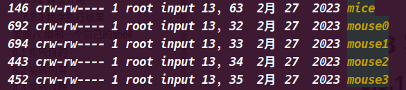

[TOC]

# 实验一 操作系统的进程调度

# 1.1 实验目的

​		进程是操作系统最重要的概念之一，进程调度又是操作系统核心的主要内容。本实习要求学生独立地用高级语言编 写和调试一个简单的进程调度程序。调度算法可任意选择或自行设计。例如，简单轮转法和优先数法等。本实习可加深对于进程调度和各种调度算法的理解。

# 1.2 实验内容

- a. 设计一个有 n 个进程工行的进程调度程序。每个进程由一个进程控制块（PCB）表示。进程控制块通常应包含下述信息：进程名、进程优先数、进程需要运行的时间、占用 CPU 的时间以及进程的状态等，且可按调度算法的不同而增删。

- b. 调度程序应包含 2～3 种不同的调度算法，运行时可任意选一种，以利于各种算法的分析比较。

- c. 系统应能显示或打印各进程状态和参数的变化情况，便于观察诸进程的调度过程。

# 1.3 实验过程

## 1.3.1 程序框架

***数据结构：***

1. 枚举类型变量，用来声明进程的三个状态，本次实验简单来处理：只考虑进程运行时候的三个状态：运行中状态、处于等待状态、完成状态；

```C++
enum class MyEnum{ RUNNING, WAITING, FINISH};
```

2. 进程类，用来模拟系统中的进程：

```C++
class Cpu
{
protected:
	list<Process> _wlist;
	list<Process> _rlist;

	// used to show the status of process timely
	list<Process> _output;
public:
	Cpu() = default;
	Cpu(list<Process> wlist, list<Process> rlist);
	~Cpu() = default;

	void show_process_status() const;
	void show_running_waiting() const;
	bool Cpu_status() const;
#ifdef PRIORITY
	void priority_schedule();
#endif
#ifdef ROUND
	void round_schedule();
#endif
};
```

其中系统对于两种调度算法的选择，我是由自定义的宏来进行选择的，我们在编译文件的时候可以去选择编译哪一个版本，每一种版本对应一种算法。

3. CPU类，用来模拟实际上的操作系统，由该类来进行两种调度算法的执行：

```C++
class Cpu
{
protected:
	list<Process> _wlist;
	list<Process> _rlist;
	// used to show the status of process timely
	list<Process> _output;
public:
	Cpu() = default;
	Cpu(list<Process> wlist, list<Process> rlist);
	~Cpu() = default;
	void show_process_status() const;
	void show_running_waiting() const;
	bool Cpu_status() const;

#ifdef PRIORITY
	void priority_schedule();
#endif
#ifdef ROUND
	void round_schedule();
#endif
};
```

我们可以看到我们声明了两个队列用来分别存放***正在运行***的进程以及***处于等待状态***的进程，还使用了一个***队列专门用来实时打印所有的进程的状态***。

## 1.3.2 算法介绍

本次实验当中，我选择了优先级方法和简单轮转方法来进行模拟进程的调度。

***优先级方法：***

算法的实现借助于递归来进行实现，一开始所有的进程都**位于等待队列**当中，接着CPU开始对进程进行调度，比较**运行中队列**，如果运行中队列为空的话，就从已经按照优先级大小排好序的进程队列中取出来一个进程进行调度，在调度的过程中，每次过一个时间片，其优先级就会同步减去3。与此同时，与处于等待状态的第一个进程（**优先级最高**）进行优先级比较，如果说处于等待队里的进程优先级更高的话，就将其放入运行中队列，并将之前的那个进程拿出来放在等待队列当中，并且排好序，接着再进行递归调度，知道两个队列都为空的话结束调度：

```C++
while (!cpu.Cpu_status())
{
   sleep(1);
   system("clear");
   cpu.show_running_waiting();
   cpu.show_process_status();
   cout << "================================================================" << endl;
}
cout << "SYSTEM FINISHED!!" << endl;
```

***时间片轮转算法：***

该算法的实现非常简单，我在创建进程的时候，使用随机数来为每一个进程的时间片赋值：

```C++
Process::Process() :
	_pid(rand() % 1000),
	_next(nullptr),
	_round_time(rand() % 10 + 1),
	_used_time(0),
	_need_time(rand() % 20),
	_status(MyEnum::WAITING)
{}
```

接着就是处于等待队列中的进程按照先后创建顺序进行排序，并且依次进行调度，时间片使用完毕之后（我的实现就是`sleep`函数），如果还没有运行结束的话，就将其移动到等待队列的末尾进行等待，让CPU调度下一个进程，这样一直调度直到所有进程全部运行完毕。

## 1.3.2 程序执行结果

**针对于优先级调度算法的执行结果：**


**针对于时间片简单轮转算法的执行结果**


# 实验二 死锁观察与避免

# 2.1 实验目的

    	死锁会引起计算机工作僵bool isSafe(vector<Process> &processes, vector<int> available, vector<bool> &finished) {
    std::vector<Process>::size_type num_processes = processes.size();
    std::vector<int>::size_type num_resources = available.size();
    
    vector<int> work = available;
    vector<bool> finished_temp = finished;
    int count = 0;
    while (count < num_processes) {
        bool found = false;
        // If no available resources can be found for all current processes,
        // found will be assigned the value false, the function will return with false
        for (int i = 0; i < num_processes; i++) {
            if (!finished_temp[i] && processes[i].need <= work) {
                for (int j = 0; j < num_resources; j++) {
                    work[j] += processes[i].allocation[j];
                }
                finished_temp[i] = true;
                found = true;
                count++;
            }
        }
        if (!found) {
            return false;
        }
    }
    return true;
}死，造成整个系统瘫痪。因此，死锁现象是操作系统特别是大型系统中必须设法防止的。学生应独立的使用高级语言编写和调试一个系统动态分配资源的简单模拟程序，观察死锁产生的条件，并采用适当的算法，有效的防止死锁的发生。通过实习，更直观地了解死锁的起因，初步掌握防止死锁的简单方法，加深理解课堂上讲授过的知识。

# 2.2 实验内容

- 设计一个 n 个并发进程共享 m 个系统资源的系统。进程可动态地申请资源和释放资源。系统按各进程的申请动态地分配资源。

- 系统应能显示各进程申请和释放资源以及系统动态分配资源的过程，便于用户观察和分析。

- 系统应能选择是否采用防止死锁算法或选用何种防止算法（如有多种算法）。在不采用防止算法时观察死锁现象的发生过程。在使用防止死锁算法时，了解在同样申请条件下，防止死锁的过程.

本次实验对其进行适当的改进，通过银行家算法实现对进程申请资源的调度。

# 2.3 实验过程

## 2.3.1 程序框架

***数据结构：***

本次实验较为简单，数据结构也是很简单：

```C++
class Process {
public:
    int pid;
    vector<int> allocation;
    vector<int> max;
    vector<int> need;
};
```

我们创建了一个进程类，用来模拟实际的进程，里面的成员变量有：进程号（`pid`）、已经申请到的资源量（`allocation`）、最大申请的资源量（`max`）、需要的资源量（`need`）。

***工具函数介绍：***

1. 该函数是判断进程申请的资源能否造成系统不安全：

```C++
bool isSafe(vector<Process> &processes, vector<int> available, vector<bool> &finished);
```

2. 该函数是当进程申请的资源通过审核之后，我们模拟释放相应的资源：

```C++
void deallocateResources(Process& process, vector<int>& available);
```

3. 该函数判断进程申请的资源的大小合适问题：

```C++
// 检查进程申请的资源是否大于自身的需求量
bool checkLessNeed(Process& process, vector<int> &request);
// 检查进程申请的资源是否大于系统的可用资源量
bool checkLessAvail(vector<int>& available, vector<int> &request);
```

## 2.3.2 算法介绍

***银行家算法：***

```c++
bool isSafe(vector<Process> &processes, vector<int> available, vector<bool> &finished) {
    std::vector<Process>::size_type num_processes = processes.size();
    std::vector<int>::size_type num_resources = available.size();

    vector<int> work = available;
    vector<bool> finished_temp = finished;
    int count = 0;
    while (count < num_processes) {
        bool found = false;
        // If no available resources can be found for all current processes,
        // found will be assigned the value false, the function will return with false
        for (int i = 0; i < num_processes; i++) {
            if (!finished_temp[i] && processes[i].need <= work) {
                for (int j = 0; j < num_resources; j++) {
                    work[j] += processes[i].allocation[j];
                }
                finished_temp[i] = true;
                found = true;
                count++;
            }
        }
        if (!found) {
            return false;
        }
    }
    return true;
}
```

银行家算法实际上就是我们先满足进程的申请，然后针对下面的所有的进程的申请是否存在一个安全序列的问题的求解。

> 银行家算法是从当前状态出发，按照系统各类资源剩余量逐个检查各进程需要申请的资源量，找到一个各类资源申请量均小于等于系统剩余资源量的进程`P1`。然后分配给该`P1`进程所请求的资源，假定`P1`完成工作后归还其占有的所有资源，更新系统剩余资源状态并且移除进程列表中的`P1`，进而检查下一个能完成工作的进程。如果所有进程都能完成工作，则找到一个安全序列，当前状态是安全的。则当前状态不安全。

## 2.3.3 程序执行结果

执行程序并进行输入初始化：


该实例中，很不幸，全部都不可以申请，都会导致系统变成不安全状态。


# 实验三 请求页式存储管理

# 3.1 实验目的

​		近年来，由于大规模集成电路（LSI）和超大规模集成电路（VLSI）技术的发展，使存储器的容量不断扩大，价格大幅度下降。但从使用角度看，存储器的容量和成本总受到一定的限制。所以，提高存储器的效率始终是操作系统研究的重要课题之一。虚拟存储技术是用来扩大内存容量的一种重要方法。学生应独立地用高级语言编写几个常用的存储分配算法，并设计一个存储管理的模拟程序，对各种算法进行分析比较，评测其性能优劣，从而加深对这些算法的了解。

 		为了比较真实地模拟存储管理，可预先生成一个大致符合实际情况的指令地址流。然后模拟这样一种指令序列的执行来计算和分析各种算法的访问命中率。

​		鉴于本人能力有限，本实验进行压缩，仅仅实现了两个算法：最佳淘汰算法 ( OPT ) 和最近最少使用页面淘汰算法 ( LRU ), 然后通过输入相关的资源数量来进行模拟页面的调度。

# 3.2 实验内容

本次实验目的是为了考察我们内存页面置换算法，我的实现方案是，通过输入系统中内存的大小，以及请求的页面序列来模拟实际上的页面的请求，利用`OPT`和`LRU`两个算法来模拟系统中对于内存中页面的调度，最后通过返回在***调度过程中发生页面置换的次数***以及***发生页面缺页异常的次数***来比较两个算法的优劣。

当然，最佳淘汰算法(OPT)现实中是肯定的不存在的，我们在这里仅仅是作为比较来看的，如果我们页面调度算法的***缺页次数***以及页***面置换次数***和最佳淘汰算法是十分接近的话，就说明我们的算法设计的很好，此处仅仅作为衡量标准。

# 3.3 实验过程

## 3.3.1 程序框架

***数据结构：***

本次实验当中，数据结构十分简单，我们使用数组来存储所有的请求页面的序列：

```C++
vector<int> pages(m);

// 此处由我们手动输入
for (int i = 0; i < m; i++)
   cin >> pages[i];
```

我们同样使用数组来模拟我们的内存，里面存储的是我们已经存在内存中的页面：

```C++
// 一开始初始化为-1，表明没有任何的页面在内存当中
vector<int > memory(n, -1);
```

## 3.3.2 算法介绍

***算法的实现：***

```C++
// 最佳淘汰算法(OPT)的实现：
std::pair<int, int> OPT(vector<int> pages, vector<int> memory);
```

> 这是一种理想的算法，可用来作为衡量其他算法优劣的依据，在实际系统中是难以实现的，因为它必须先知道指令的全部地址流。由于本示例中已预先生成了全部的指令地址流，故可计算出最佳命中率。该算法的准则是淘汰已满页表中不再访问或是最迟访问的的页。这就要求将页表中的页逐个与后继指令访问的所有页比较，如后继指令不在访问该页，则把此页淘汰，不然得找出后继指令中最迟访问的页面淘汰。可见最佳淘汰算法要花费较长的运算时间。

```C++
// 最近最少使用页淘汰算法(LRU)的实现：
std::pair<int, int> LRU(std::vector<int> pages_, int num_pages);
```

> 这是一种经常使用的方法，有各种不同的实施方案，这里采用的是不断调整页表链的方法，即总是淘汰页表链链首的页，而把新访问的页插入链尾。如果当前调用页已在页表内，则把它再次调整到链尾。这样就能保证最近使用的页，总是处于靠近链尾部分，而不常使用的页就移到链首，逐个被淘汰，在页表较大时，调整页表链的代价也是不小的.

两个算法均返回使用该算法进行调度时候的数据：

- 缺页异常的次数；
- 页面置换的次数；

## 3.3.3 程序执行结果


# 实验四 文件操作与管理

# 4.1 实验目的

​		随着社会信息量的极大增长，要求计算机处理的信息与日俱增，涉及到社会生活的各个方面。因此，文件管理是操作系统的一个极为重要的组成部分。学生应独立地用高级语言编写和调试一个简单的文件系统，模拟文件管理的工作过程。从而对各种文件操作命令的实质内容和执行过程有比较深入的了解，掌握它们的实施方法，加深理解课堂上讲授过的知识。

# 4.2 实验内容

复习操作系统中有关文件系统的知识，熟悉文件的类型、i 节点、文件属性、文件系统操作等概念。

熟悉《实验指导》第五部分“文件系统的系统调用”。了解 Linux 文件系统的特点、分类。

# 4.3 实验过程

> 本次实验由于个人能力限制，导致最后在调度线程的时候出现了死锁的现象，导致后面的程序运行结构无法运行。

## 4.3.1 程序框架

***数据结构***：

**用户类**，用来模拟系统中存在的用户以及用来存储该用户拥有的文件：

```	c++
class UFD
{
public:
  UFD();
  UFD(const std::string & name_):user_name(name_) {};
  void addFile(FileHandler && file);
  std::string getName()const {return user_name;};
  void displayFiles();
  UFD(UFD &&) = default;
  UFD(const UFD &) = default;
  UFD &operator=(UFD &&) = default;
  UFD &operator=(const UFD &) = default;
  ~UFD();

private:
  std::string user_name;
  std::vector<FileHandler> file_vector;
};
```

**文件类**，用来存储该文件的拥有者、名字、文件的长度以及文件的权限：

```C++
class FileHandler {
public:
  FileHandler() = default;
  FileHandler(const std::string & filename, const std::string & owner_) 
        : file_name(filename), 
          owner(owner_),
          permission({Limits::read, Limits::write, Limits::none}),
          length(0)
  {}
  FileHandler(const FileHandler& file){
    file_name = file.file_name;
    owner = file.owner;
    permission = file.permission;
    length = file.length;
  }
··········

private:
  std::string file_name;
  std::string owner;
  std::vector<Limits> permission;
  std::size_t length;
};
```

线程执行的程序，模拟每一个用户可用的操作：

```C++
bool threadExec(std::string command, UFD & user){
  std::string file_name;
  std::ofstream out_file;
  std::ifstream in_file;
  char ch;
  // ls -al:
  if (command == "ls") {
    cout << "list all files:" << endl;
    user.displayFiles();
  }else if (command == "touch") {
  //····· 程序省略

  }else if (command == "delete") {
  //····· 程序省略

  }else if (command == "read") {
  //····· 程序省略
      
  }else if (command == "write") {
  //····· 程序省略

  }else if (command == "exit") {
  //····· 程序省略
  }
}
```

检查用户权限，这里就是很简单的检查一下文件的所属用户名以及文件是否存在：

```C++
bool checkIsmine(const std::string &file_name, const std::string &user){
  bool find;
  for (auto & a : allFiles) {
    if (a.getName() == file_name && a.getUsername() == user) {
      find = true;
      return true;
    }
  }
  return false;
}
```

## 4.3.2 程序执行结果


# 实验五 Linux文件系统实验

# 5.1 实验目的

- 掌握操作系统中文件分类的概念；
- 了解Linux文件系统管理文件的基本方式和特点；
- 学会使用Linux文件系统的命令界面和程序界面的基本要领；

# 5.2 实验内容

1. 使用shell命令查看Linux文件类型。

操作系统中常见的文件类型有：***普通文件  -   、目录   d   、字符设备文件    c    、块设备文件    b   、符号链接文件   l***等。


我们主要看第一列，我们可以看到其中有很多目录文件，所以说文件属性中的第一列为   **d** ，我们还可以看到还有普通文件`ls.cpp`和`testvector.cpp`文件，其文件属性为  **-**  ，表示普通文件。


这些文件属性第一列为  l   ，说明该文件为符号链接文件。


这些文件属性第一列为  b   , 表明这些文件为块设备文件，这些文件是什么呢？我们使用命令`sudo fdisk -l`来看一下：


我们可以看到其实这些块设备就是这一台笔记本中所有的硬件设备，上面四个是我电脑上的原始的Windows系统，最下面的是我创建的第二个操作系统ubuntu.

我们使用命令`ll /dev/input`查看系统中的鼠标设备：



我们可以看到文件属性列中第一个属性代表该文件类型为字符设备文件。

2. 使用shell命令了解Linux文件系统的目录结构。

```shell
$ cd lib
$ ls -l | more
```


3. 使用命令分别建立硬链接和符号连接文件。


首先我们先创建一个硬链接，`Hello.cpp`文件链接`Link.cpp`文件，所以我们可以看到该两个文件中的内容是一样的。

然后我们使用`ll -i | grep Hello.cpp `和`ll -i | grep Link.cpp`去查看二者的索引文件的编号：


我们可以很清楚的看到二者的索引节点编号是一样的。

接着我们尝试删除`Link.cpp`文件来观察`Hello.cpp`文件是否也是跟着一起删除：


我们可以看到，即使你将`Link.cpp`文件删除的话，`Hello.cpp`文件没有收到一丝的影响，这就是硬链接的特性：***由于多个目录项都是指向一个inode的，所以说只有删除了文件的所有的硬链接以及源文件之后，系统才会彻底的删除该文件。***

我们接下来观察软连接：

首先我们先建立软连接，`Hello.cpp`文件链接`Link.cpp`文件：


我们可以看到和硬链接一样的效果，接下来就不一样了，我们观察其索引节点编号：


我们可以看到，二者的索引节点编号就不一样了。如果我们删除原来的文件`Link.cpp`来查看`Hello.cpp`文件：


我们可以看到，会提示没有相应的文件，这是为什么呢？


软链接相当于重新创建一个文件，这个文件有**独立的 inode**，但是这个**文件的内容是另外一个文件的路径**，所以访问软链接的时候，实际上相当于访问到了另外一个文件，所以**软链接是可以跨文件系统的**，甚至**目标文件被删除了，链接文件还是在的，只不过指向的文件找不到了而已。**

4. 编程查看指定文件的inode信息。

```c
#include <sys/stat.h>
#include <sys/types.h>
#include <sys/sysmacros.h>
#include <stdio.h>
#include <time.h>
#include <unistd.h>
#include <string.h>
#include <errno.h>
#define TIME_STRING_LEN 50

char * time2String(time_t tm, char *buf){
  struct tm *local;
  local  = localtime(&tm);
  strftime(buf, TIME_STRING_LEN, "%c", local);
  return buf;
}

int ShowFileInfo(char * file) {
  struct stat buf;
  char timeBuf[TIME_STRING_LEN];
  if (lstat(file, &buf)) {
    perror("lstat() error");
    return 1;
  }
  printf("\nFile:%s\n", file);
  printf("On device(major/minor):%d %d,inode number:%ld\n",
         major(buf.st_dev),minor(buf.st_dev), buf.st_ino);

  printf("Size:%ld\t Type: %07o\t Permission: %05o\n",buf.st_size,buf.st_mode & S_IFMT, buf.st_mode & ~(S_IFMT));
  printf("Ower id: %d\t Group id : %d\t Number of hard links:%d\n", buf.st_uid, buf.st_gid, buf.st_nlink);
  printf("Last access:%s\n", time2String(buf.st_atime, timeBuf));
  return 0;
}

int main (int argc, char *argv[])
{
  int i, ret;
  for (i = 1; i < argc; i++) {
    ret = ShowFileInfo(argv[i]);
    if (argc - i > 1) {
      printf("\n");
    }
  }
  return ret;
}

```


我们可以看到程序的运行结果完全和实际上的内容相符合。

5. ​	**再来一个更有趣的实验。修改父进程创建子进程的程序，用显示程序段、数据段地址的方法，说明子进程继承父进程的所有资源。再用父进程创建子进程，子进程调用其它程序的方法进一步证明子进程执行其它程序时，程序段发生的变化。**  

```C
#include<stdio.h>
extern int etext,edata,end;
main()
{
        printf("etext:%6x \t edata:%6x \t end:%6x \n",&etext,&edata,&end);
}
```

执行结果：


```C
#include<stdio.h>
#include<string.h>
#include<sys[表情]pes.h>
#include<stdlib.h>
#include<unistd.h>
#define SHW_ADR(ID,I) printf("The id %s \t is at adr:%8X\n",ID,&I);
extern int etext,edata,end;
char *cptr="Hello World.\n";
char buffer1[25];
main()
{
        void showit(char *);
int i=0;
printf("Adr etext:%8x\t Adr edata:%8x Adr end:%8x\n\n",&etext,&edata,&end);
SHW_ADR("main",main);
SHW_ADR("showit",showit);
SHW_ADR("cptr",cptr);
SHW_ADR("buffer1",buffer1);
SHW_ADR("i",i);
strcpy(buffer1,"A demonstration\n");
write(1,buffer1,strlen(buffer1)+1);
for(;i<1;++i)
showit(cptr);
}
void showit(char *p)
{
char *buffer2;
SHW_ADR("buffer2",buffer2);
if((buffer2=(char *)malloc((unsigned)(strlen(p)+1)))!=NULL)
{ strcpy(buffer2,p);
printf("%s",buffer2);
free(buffer2);
}
else{
printf("Allocation error.\n");
exit(1);
}
}
```

运行结果：


6. 编写一个涉及流文件的程序。要求：

- 以只读方式打开一个源文本文件
- 以只读方式打开另一个源文本文件
- 以只写方式打开目标文本文件
- 将两个源文件内容复制到目标文件
- 将目标文件改为指定的属性（其他人只读、文件主可读写）
- 显示目标文件

```C
#include <sys/types.h>
#include <stdio.h>
int main (int argc, char *argv[])
{
  char s[1024];
  FILE *fp;
  if((fp = fopen(argv[1], "r")) != (FILE*)0){
    while ((fgets(s,1024, fp)) != (char*) 0) {
      puts(s);
    }
  }else {
    fprintf(stderr, "file open error.\n");
    exit(1);
  }
  exit(0);
}

```


# 实验七 内存分配和设备管理实验

# 7.1 实验目的

了解Linux管理设备的基本方式。

# 7.2 实验内容

用 ls –l 命令观察设备文件的组织方式：


`$ ls /dev | wc > data.out `(将设备文件名通过管道送到 `wc` 命令计算设备文件名的行数，结果重定向传送到文件 `data.out` 中，计算设备文件个数。)

`$ cat data.out `（显示结果）


**思考：**Linux 管理设备的方法与管理文件的方式有何异同?为什么用文件的方式来管设备?有什么好处？

答：Linux管理设备和管理文件的方法有一些异同。在Linux中，设备可以是硬件设备（例如磁盘、键盘、鼠标等）或虚拟设备（例如tty、pty等）。设备和文件之间的主要区别在于设备是通过特殊文件来表示的，而文件则是通过普通文件来表示的。

异同点：

路径不同：设备通常被表示为/dev目录下的特殊文件，而文件则可以存储在任何目录下。

访问权限不同：设备文件通常有较严格的权限，只有特定的用户或组才能访问它们。而对于文件，用户通常有更大的自由度来控制它们的权限。

访问方式不同：设备文件需要使用特殊的命令或工具来访问和管理，而文件可以使用标准的Linux命令进行管理。

为什么使用文件的方式来管理设备？

在Linux中，设备可以被看作是特殊的文件，它们可以使用相同的Linux文件系统和权限模型进行管理。这种方法的好处是可以使用户和管理员使用相同的方法来管理所有的资源，从而使管理变得更加一致和简单。另外，使用文件的方式来管理设备也使得设备更容易被集成到脚本和其他自动化工具中，从而提高了系统的可维护性和可伸缩性。

同时，设备文件可以被认为是一种接口，它提供了对底层设备的抽象，使得用户和应用程序可以通过相同的方式来访问和控制设备。这种抽象层使得设备更容易使用，并且可以使应用程序更容易移植到不同的设备上。

**参照例程** **12** **编程，显示设备文件的设备号信息。**

```C
#include <sys/types.h>
#include <sys/stat.h>
#include <sys/sysmacros.h>
#include <stdio.h>
#include <time.h>
#include <unistd.h>
#include <string.h>
#include <errno.h>

int main (int argc, char *argv[])
{
  int i;
  struct stat buf;
  for (i = 1; i < argc; i++) {
    printf("%s", argv[i]);
    if (lstat(argv[i], &buf) < 0) {
      error("lstat error");
      continue;
    }
    printf("dev = %d %d ",major(buf.st_dev), minor(buf.st_dev));
    if (S_ISCHR(buf.st_mode) || S_ISBLK(buf.st_mode)) {
      printf("(%s) rdev = %d %d",(S_ISCHR(buf.st_mode)), "character:block", major(buf.st_rdev), minor(buf.st_rdev));
    }
    printf("\n");
  }


  return 0;
}

```


# 实验八 编制一个自己的shell

# 8.1 实验目的

综合所学知识，增加感性认识，加强对操作系统实现方式的理解。

# 8.2 实验内容

模拟Linux的shell，实现一个命令解释器。从标准输入读入命令行并执行。每次只处理一个命令，不过可以是一个复杂命令，例如可以包含管道、输入输出重定向、后台执行等等。

# 8.3 实验过程


